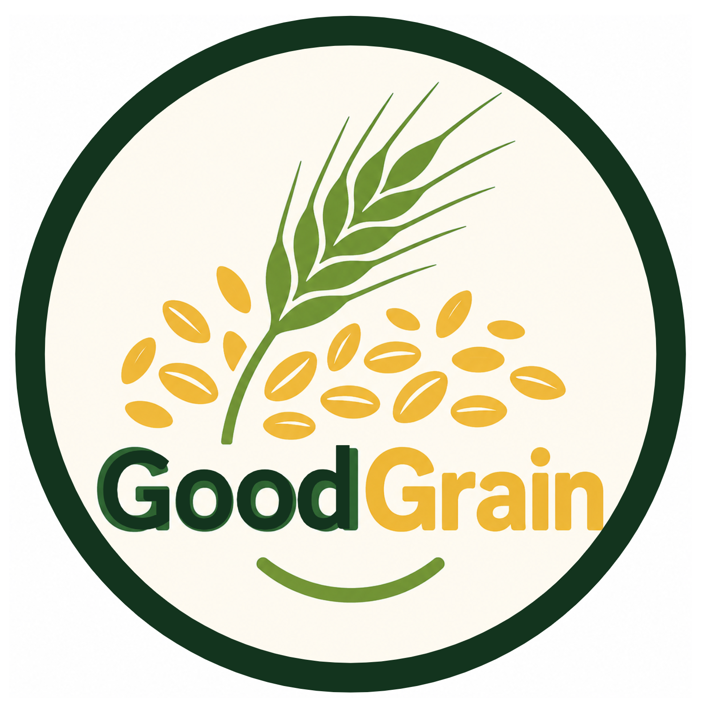

# About the GoodGrain Home Baking Project

This website is dedicated to the **GoodGrain Home Baking Project**, a home baking initiative that is part of the larger GoodGrain research grant. Here you can read:

- The Informational Sheet in English

- The Informational Sheet in Danish

The big picture of this research is to explore how perennial cereal rye might contribute to more sustainable food systems. We are researching how the crop behaves in the field, however important questions remain about the safety, quality, and nutritional properties of grain harvested from perennial rye.

The **GoodGrain** project investigates these questions by:

- Evaluating **grain and baking quality**, from laboratory analyses to bakery trials.
- Exploring relationships between perennial cropping, soil health, and potentially beneficial **nutritional compounds** such as ergothioneine.
- Assessing **natural contaminants**, including fungal alkaloids, in perennial and annual rye.
- **Connecting** researchers with farmers, food businesses, retailers, and policymakers, and sharing results openly.

The **Home Baking Project** brings this research into people’s kitchens. By inviting participants to bake with rye flour and share their experiences, we aim to learn more about how perennial rye flour performs in everyday baking and how people respond to it.

Learn more about the wider research project on the [GoodGrain project website](https://projects.au.dk/plant2food/funded-projects/goodgrain).

------------------------------------------------------------------------

# Om GoodGrain-projektet for hjemmebagning

Denne hjemmeside er dedikeret til **GoodGrain-projektet for hjemmebagning**, et initiativ, hvor folk inviteres til at bage derhjemme som en del af det større GoodGrain-forskningsprojekt.

Projektet undersøger, hvordan flerårig rug kan bidrage til mere bæredygtige fødevaresystemer. Sammenlignet med etårige kornsorter kan flerårige afgrøder have fordele såsom mindre jordbearbejdning, dybere og mere vedvarende rodsystemer, bedre næringsstofoptagelse og større modstandsdygtighed over for ekstreme vejrforhold. Der er dog stadig vigtige spørgsmål om sikkerheden, kvaliteten og næringsindholdet i korn høstet fra flerårige kornsorter.

Det overordnede GoodGrain-projekt undersøger disse spørgsmål ved at:

- Undersøge forekomsten af naturlige forurenende stoffer, herunder svampealkaloider, i flerårig og etårig rug.
- Evaluere kornets kvalitet og bageegenskaber – fra laboratorieanalyser til bageforsøg i bagerier.
- Undersøge sammenhænge mellem flerårig dyrkning, jordens sundhed og potentielt gavnlige forbindelser såsom ergothionein.
- Skabe kontakt mellem forskere, landmænd, fødevarevirksomheder, detailhandlen og beslutningstagere samt dele resultaterne åbent.

**Hjemmebagningsprojektet** bringer forskningen ind i folks køkkener. Ved at invitere deltagere til at bage med rugmel og dele deres erfaringer ønsker vi at lære mere om, hvordan mel fra flerårig rug fungerer i hverdagsbagning, og hvordan folk oplever det.

Læs mere om det overordnede forskningsprojekt på [GoodGrain-projektets hjemmeside](https://projects.au.dk/plant2food/funded-projects/goodgrain).
